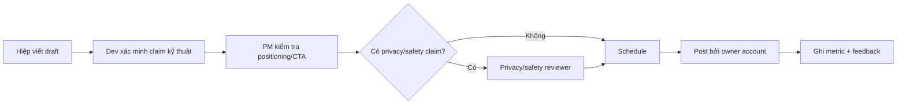

# Build in public narrative

**Jira:** [KAN-38](https://aichoem.atlassian.net/browse/KAN-38)  
**Owner:** Hoàng Hiệp  
**Trạng thái:** 5 draft chờ reviewer  
**Cập nhật:** 2026-07-15

## Narrative cố định

> Tụi mình đang xây WonderLens — app giúp bố mẹ cùng trẻ hiểu đồ vật quanh mình
> bằng camera AI: chụp một món đồ, xem hành trình vật liệu và cách nó được tạo ra.

Ba ý phải giữ nhất quán:

1. Đây là hoạt động gia đình, không phải app để trẻ tự lên mạng.
2. AI hỗ trợ nhận diện/kể chuyện; nội dung live có giới hạn và cần safety review.
3. Team chia sẻ tiến độ thật, kể cả blocker, không biến target thành kết quả.

## Template update

```text
Hôm nay tụi mình làm: [một thay đổi cụ thể]
Tụi mình học được: [evidence / điều bất ngờ]
Demo: [ảnh/video UI thật, không có dữ liệu trẻ]
Việc tiếp theo: [mốc có thể kiểm chứng]
Cần feedback từ: [phụ huynh / giáo viên / builder]
CTA: [beta/waitlist/follow — dành cho người lớn]
```

## Milestone được phép kể

| Milestone | Bằng chứng tối thiểu trước khi post |
|---|---|
| Android beta | AAB/track + core smoke test, không chỉ build local |
| Camera redesign | Video capture thật hoặc widget screenshot từ HEAD |
| Safety audit | Rubric, sample size, pass/fail; không chỉ nói “đã có prompt” |
| 8 hero objects | Asset/content paths + offline test |
| First parent testers | Có consent; chỉ số aggregate, không quote riêng nếu chưa xin phép |

## Red lines

- Không đăng ảnh/video trẻ, tên, trường, giọng hoặc feedback riêng nếu chưa có
  consent cụ thể cho public use.
- Không đăng screenshot chứa token, email console, device ID, API response/log.
- Không gọi AI “100% chính xác/an toàn”.
- Không nói App Store/Google Play approved khi chỉ mới upload build.
- Không dùng comment/testimonial bịa hoặc không ghi nguồn.
- Không công khai security weakness đang exploitable; báo/fix trước.
- Không kêu trẻ đăng ký beta hoặc gửi ảnh.

## Review flow



Không ai được tự bỏ review gate vì post “chỉ là build-in-public”.

## 5 post drafts

### Draft 1 — Camera đến câu chuyện

**Hook:** Một tấm ảnh cần đi qua bao nhiêu bước để thành câu chuyện cho bé?

Hôm nay tụi mình nối trọn flow WonderLens: phụ huynh cùng bé chụp một đồ vật,
app tách nền ngay trên máy, gửi ảnh qua proxy tới AI, rồi mở hành trình vật liệu
bằng tiếng Việt. Điều khó nhất không phải hiệu ứng camera — mà là làm mọi lỗi
mạng/media rơi về một trải nghiệm dễ hiểu, không làm bé mắc kẹt.

**Asset:** screen recording camera → reveal → timeline từ build thật.  
**CTA:** Phụ huynh Android muốn thử closed beta có thể đăng ký khi waitlist mở.  
**Review:** Dev xác nhận flow; privacy duyệt mô tả data path.

### Draft 2 — Safety không chỉ là một prompt

**Hook:** “Prompt bảo AI an toàn” chưa phải safety audit.

WonderLens dành cho gia đình có trẻ 6–10, nên tụi mình đang biến safety thành
release gate: bộ ảnh/prompt bình thường, mơ hồ và nguy hiểm; hai reviewer; lỗi
critical làm beta fail. AI-live luôn có nhãn, và nội dung curated vẫn là phần có
độ tin cậy cao hơn. Khi audit chưa pass, tụi mình sẽ nói rõ là chưa pass.

**Asset:** ảnh rubric không chứa test image nhạy cảm.  
**CTA:** Mời phụ huynh/giáo viên góp thêm category cần red-team.  
**Review:** PM + safety reviewer.

### Draft 3 — Vì sao không dùng tài khoản trẻ

**Hook:** Có những feature tăng trưởng tụi mình chủ động không xây.

WonderLens không có public profile, chat hay leaderboard cho trẻ. Nhật ký và bộ
sưu tập nằm trên thiết bị; chia sẻ chỉ mở khi người lớn chủ động chọn. Tụi mình
muốn mỗi “viral loop” bắt đầu từ thẻ đồ vật/fun fact, không từ dữ liệu hay áp lực
mời bạn của bé.

**Asset:** collection + share preview, không có ảnh người.  
**CTA:** Bạn muốn thẻ khám phá của gia đình hiển thị thông tin gì?  
**Review:** Privacy + PM.

### Draft 4 — 8 đồ vật, 8 cánh cửa STEM

**Hook:** Một chiếc cốc giấy có thể mở ra câu chuyện về cây, sợi và tạo hình.

Tụi mình bắt đầu với một bộ đồ vật quen thuộc để câu chuyện vẫn dùng được khi
không gọi AI-live: mỗi vật có nội dung, hình và giọng kể tiếng Việt. Mục tiêu
không phải có danh mục thật dài, mà là mỗi hành trình đủ ngắn, đúng tuổi và giúp
phụ huynh hỏi tiếp một câu hay.

**Asset:** grid object cutouts + một stage curated.  
**CTA:** Giáo viên/phụ huynh muốn tụi mình kiểm chứng món đồ nào tiếp?  
**Review:** Content/safety reviewer xác nhận số lượng tại ngày post.

### Draft 5 — Mời nhóm phụ huynh đầu tiên

**Hook:** Tụi mình cần biết khoảnh khắc “wow” có xảy ra ngoài máy dev không.

Closed beta sắp tới sẽ đo vài thứ rất cụ thể: bao lâu từ nút chụp tới kết quả,
bao nhiêu lượt phải chụp lại, trẻ có xem hết hành trình không, và output AI có
qua safety rubric không. Chúng mình chỉ nhận đăng ký từ người lớn, không yêu cầu
ảnh hay thông tin của trẻ trong form.

**Asset:** demo GIF/video + metric card.  
**CTA:** Link waitlist sau khi privacy/data owner đã duyệt.  
**Review:** PM + privacy; không post link trước gate.

## Metric log

Mỗi post ghi channel, publish time, reach, video completion, saves, meaningful
comments, link clicks, adult waitlist signups và 3 insight định tính. Không lấy
vanity metric làm bằng chứng product-market fit.

