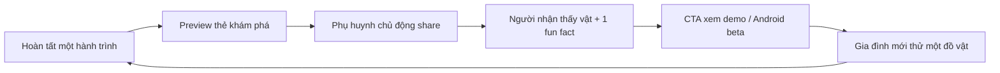
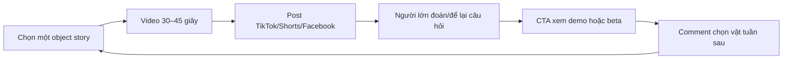
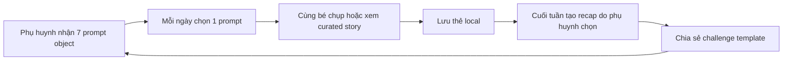

# Viral loop strategy

**Jira:** [KAN-36](https://aichoem.atlassian.net/browse/KAN-36)  
**Owner:** Hoàng Hiệp  
**Trạng thái:** Bản chờ PM duyệt  
**Cập nhật:** 2026-07-15

## Mục tiêu

Tạo tăng trưởng tự nhiên từ khoảnh khắc giá trị thật của WonderLens — chụp một
đồ vật và hiểu hành trình của nó — mà không tạo tài khoản trẻ, social graph,
streak gây áp lực hoặc thu thập dữ liệu trẻ.

## Audience và CTA

| Audience | Giá trị muốn thấy | CTA an toàn |
|---|---|---|
| Phụ huynh | Hoạt động STEM ngắn để làm cùng con | Đăng ký Android beta bằng email người lớn |
| Giáo viên | Một câu chuyện vật liệu dễ mở đầu bài học | Đăng ký teacher pilot |
| Builder/investor | Camera-AI flow, safety và tiến độ thật | Theo dõi build journey / xem demo |

CTA không được kêu trẻ tự nhập email, đăng ảnh mặt, tạo profile hoặc mời bạn bè
trực tiếp trong app.

## Loop 1 — Parent discovery card

### Payload

- Cutout đồ vật, tên, vật liệu, một fun fact ngắn.
- Nhãn `Khám phá cùng WonderLens`; AI label nếu source live.
- Không có tên/tuổi/ảnh mặt/vị trí của trẻ.
- CTA chỉ dẫn tới landing dành cho người lớn.

### Trigger và guardrail

- Trigger sau completion hoặc từ nút `Khoe thành tích`; không tự bật sheet.
- Luôn có preview và nút huỷ trước system share sheet.
- Phụ huynh chọn app/người nhận; WonderLens không biết share tới đâu.
- Nếu cutout có thể chứa khuôn mặt/PII, cho phép bỏ ảnh và dùng object asset.

### Metric

- `share_preview_rate = share previews / completed journeys`.
- `share_confirm_rate = system share opens / share previews`.
- `share_to_waitlist = attributed adult signups / unique share links` chỉ khi
  có privacy-safe campaign link; chưa có thì đo thủ công.

## Loop 2 — “Đồ vật này đến từ đâu?” short video

### Format

1. Hook 0–3s: `Chiếc cốc giấy từng là gì trước khi vào tay bé?`
2. Reveal 3–20s: 2–3 chặng, object cutout và app capture.
3. Trust 20–30s: `AI hỗ trợ kể; bố mẹ cùng kiểm tra.`
4. CTA 30–45s: người lớn đăng ký beta/chọn object tiếp theo.

### Asset

- `promo/wonderlens-promo/wonderlens-promo.mp4`
- `promo/wonderlens-promo/poster.png`
- `app/store-assets/screenshots/`
- Bundled object/stage images; không dùng ảnh trẻ thật.

### Metric

- 3-second hold, 50% completion, full completion, saves, meaningful comments,
  profile/link clicks và adult waitlist conversion.
- Không tối ưu theo comment bait từ trẻ hay số lượt share không có ngữ cảnh.

## Loop 3 — Thử thách 7 ngày quanh nhà

### Prompt đề xuất

Ngày 1 giấy, ngày 2 nhựa, ngày 3 kim loại, ngày 4 gỗ, ngày 5 thuỷ tinh, ngày 6
vải, ngày 7 “món đồ bé tò mò nhất”. Chỉ gợi ý vật an toàn, không yêu cầu mở máy,
dùng lửa, hoá chất hoặc leo trèo.

### Guardrail

- Không streak, phạt, đếm ngược hay FOMO. Bỏ ngày nào cũng được.
- Parent opt-in; reminder local mặc định tắt.
- Recap chỉ chứa object cards người lớn chọn.
- Không leaderboard, friend invite hoặc hồ sơ trẻ.

### Metric

- Challenge opt-in, day-2 return, day-7 completion, recap preview/share,
  qualitative parent feedback.
- Chỉ dùng aggregate/manual beta data cho tới khi có approved analytics plan.

## Funnel chung

| Bước | Metric | Owner | Hiện đo được? |
|---|---|---|---|
| Reach | Video/post views | Hoàng Hiệp | Có từ platform |
| Interest | Meaningful comments, saves, link clicks | Hoàng Hiệp | Có từ platform |
| Intent | Adult waitlist signup | Growth/data owner | Chưa: waitlist chưa live |
| Activation | First successful camera result | QA/PM | Manual beta |
| Value | Journey completion | QA/PM | Manual beta |
| Advocacy | Share preview/confirm | QA/PM | Manual beta |
| Return | 7-day challenge return | QA/PM | Manual beta |

## Now / next / backlog

### Làm ngay

- Dùng promo video và object assets cho short video.
- Dùng share card hiện có trong beta test, quan sát thủ công.
- Chuẩn bị 7-day prompt dưới dạng post/PDF cho phụ huynh; chưa cần app feature.
- CTA tới waitlist chỉ sau khi [waitlist gate](android-beta-waitlist.md) pass.

### Sau closed beta

- Thêm campaign code không định danh vào share URL nếu privacy review duyệt.
- Tạo recap card chọn object, không tự lấy ảnh trẻ.
- A/B hook/copy ở platform level, không fingerprint app users.

### Backlog

- Teacher kit/curriculum pack.
- Referral rewards chỉ cho adult account nếu sau này có account/ADR.
- Không đưa child social profile/leaderboard vào backlog mặc định.

## PM approval

- [ ] Chọn cả 3 loop hoặc ghi loop bị loại.
- [ ] Chốt audience/CTA theo từng channel.
- [ ] Privacy reviewer duyệt share payload và waitlist.
- [ ] Metric owner xác nhận cách đo không cần child identity.
- [ ] KAN-36 chỉ Done khi growth loop map được link tới file này và PM ký.

