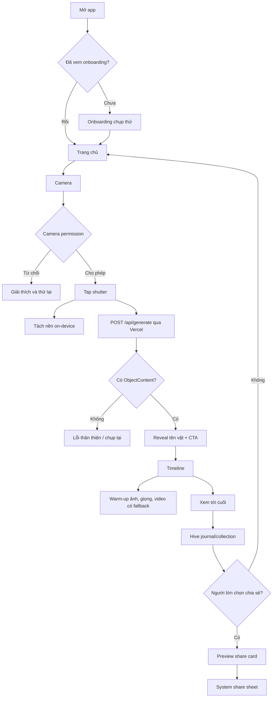
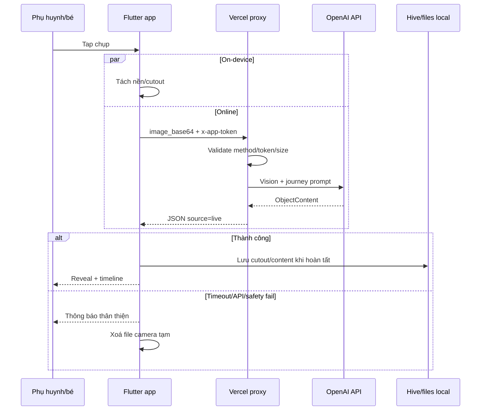
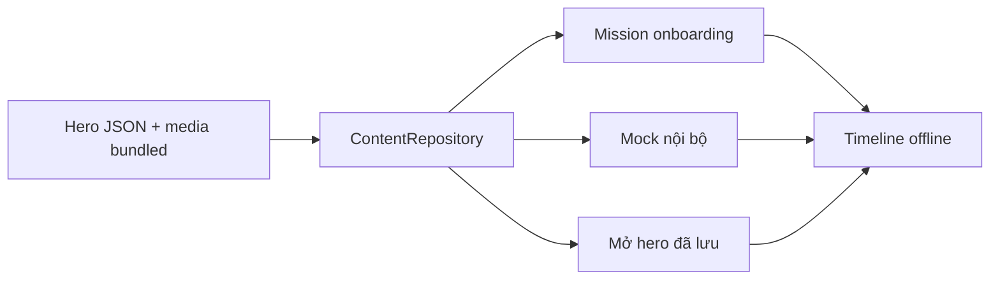
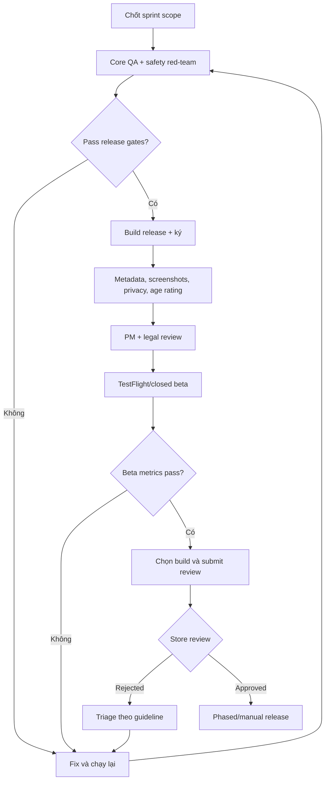

# Product flows handoff

**Jira:** [KAN-34](https://aichoem.atlassian.net/browse/KAN-34)  
**Owner:** Hoàng Hiệp  
**Trạng thái:** Chờ PM review  
**Cập nhật:** 2026-07-15

## JTBD

### Trẻ 6–10 tuổi

Khi thấy một món đồ quen mà chưa biết nó từ đâu ra, bé muốn chụp và được kể một
câu chuyện ngắn bằng hình/giọng nói, để hiểu vật liệu và thấy việc học giống một
cuộc khám phá.

### Phụ huynh

Khi con hỏi liên tục về đồ vật quanh nhà, phụ huynh muốn có một hoạt động STEM
ngắn, an toàn và có thể làm cùng con, để bắt đầu cuộc trò chuyện mà không phải
tự tìm video hay để con vào mạng xã hội.

### Giáo viên

Khi cần một hoạt động khởi động về vật liệu/sản xuất, giáo viên muốn chiếu một
hành trình đồ vật đã kiểm tra, để lớp đặt câu hỏi mà không phụ thuộc nội dung
AI-live chưa duyệt.

## Flow người dùng hiện tại

### Sự thật kỹ thuật cần nhớ

- Camera production ở HEAD gọi `/api/generate` cho **mọi ảnh**. Nó không gọi
  `/api/recognize` rồi rẽ hero/unknown như sơ đồ cũ trong specs.
- `RecognitionService` và hero bundled path vẫn tồn tại cho mock/demo và một số
  flow curated như mission/mở lại.
- Offline trong camera production hiện không tạo hero journey; app báo cần kết
  nối. Curated content đã lưu/missions vẫn dùng offline.
- App không gọi OpenAI trực tiếp. Base64 đi Flutter → Vercel → OpenAI.
- Proxy không lưu ảnh vào database, nhưng nhà cung cấp AI có retention riêng.

## Data và failure flow

## Flow onboarding đến result

1. Splash đọc cờ `onboarding_seen` từ Hive.
2. Lần đầu vào onboarding; lần sau vào `/home`.
3. Home prewarm camera nếu quyền đã có; tap scan mở `/camera`.
4. Camera xin quyền trong ngữ cảnh. Từ chối không được dẫn tới màn chết.
5. Tap chụp chạy dissolve tối thiểu 1,5 giây và `/api/generate` tối đa 35 giây.
6. Có content: reveal tên/cutout ngay trong camera; media journey warm-up ngầm.
7. Tap CTA mở timeline; narration/media lỗi phải fallback sang text.
8. Hoàn tất timeline ghi local; item mở lại từ local content.
9. Chia sẻ luôn bắt đầu bằng hành động rõ của người lớn; app không tự đăng.

## Flow curated/offline

Muốn lời hứa “chụp hero offline <5 giây” đúng lại trong production, cần task code
riêng để camera nhận diện/rẽ curated trước hoặc có on-device mapping. Tài liệu
không coi điều này đã hoàn tất.

## App Store release flow

`Submit`, `publish`, rollout và thay đổi console là external actions; branch docs
này không thực hiện thay người có quyền.

## Source links

- [Workflow](../workflow.md)
- [PRD](../../specs/prd.md)
- [Domains](../../specs/domains.md)
- [API contracts](../../specs/api-contracts.md)
- [Sprint scope](../product/sprint-scope.md)
- [Beta metrics](../product/beta-success-metrics.md)
- [ADR-002 hybrid content engine](../../adrs/ADR-002-hybrid-content-engine.md)
- [ADR-004 Vercel proxy](../../adrs/ADR-004-vercel-proxy.md)
- [TASK-017](../../tasks/TASK-017-hiep-jira-handoff.md)

## PM review

- [ ] JTBD đúng với định vị phụ huynh đồng hành cùng trẻ.
- [ ] PM xác nhận flow production online-first hiện tại.
- [ ] Quyết định có restore curated-first trước beta hay đưa vào backlog.
- [ ] Release owner xác nhận flow submit/rejection/rollout.
- [ ] Jira KAN-34 link tới file này trước khi chuyển Done.
