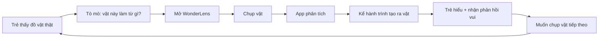
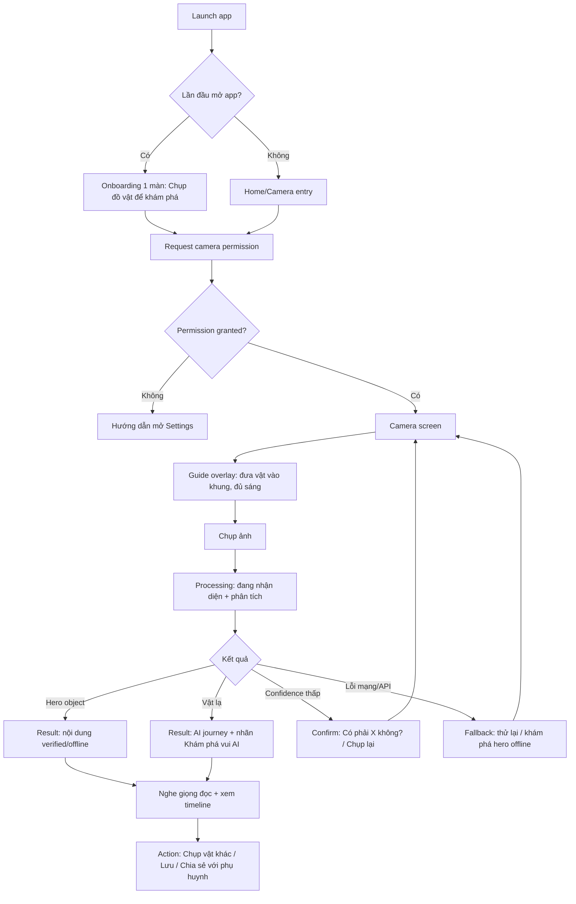
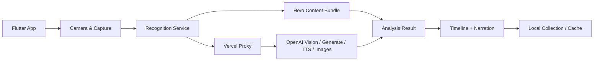
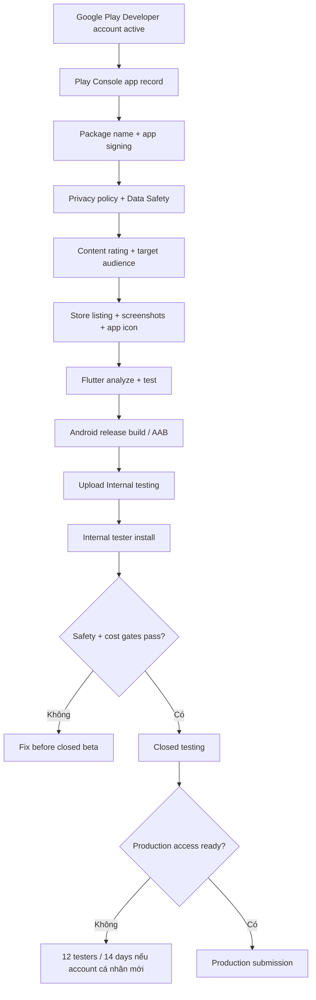

# WonderLens - Sprint tiếp theo: Jira-ready Plan

> **Mục đích:** Tạo backlog Jira cho sprint tiếp theo. Tài liệu này viết cho PM, designer, developer và reviewer.  
> **Ngày:** 2026-07-06  
> **Sprint theme:** Hoàn thiện sản phẩm để deploy **Android / Google Play trước** bằng cách tập trung vào **1 tính năng chính: chụp và phân tích vật**.  
> **Nguồn context:** `docs/workflow.md`, `AGENTS.md`, `specs/prd.md`, `specs/features.md`, `specs/domains.md`, `specs/api-contracts.md`, `adrs/`, `tasks/`, code `app/` + `proxy/`.  
> **Google Play refs kiểm tra ngày 2026-07-06:** Google Play target API requirements, Play testing requirements, Play Data Safety, Play Console internal testing.

---

## 1. Sprint Goal

**Hoàn thiện WonderLens thành một bản Android beta / Google Play-ready tập trung vào một core loop duy nhất:**

```
Bé mở app -> chụp một đồ vật -> app phân tích -> kể hành trình tạo ra vật -> bé hiểu và muốn chụp vật tiếp theo.
```

Sprint này không cố mở rộng nhiều feature. Mục tiêu là làm **một trải nghiệm chính thật tỉ mỉ**, đủ tin cậy để đưa cho phụ huynh/tester và chuẩn bị nộp Google Play Internal/Closed testing trước.

## 2. Nguyên tắc sản phẩm cho sprint

1. **Một tính năng chính:** Chụp và phân tích vật.
2. **UI/UX làm lại để phục vụ core loop:** theme màu, typography, logo, mascot, onboarding, camera, loading, result, error states.
3. **Kid-safe trước growth:** AI live phải có nhãn, guardrail, red-team trước khi mở cho trẻ thật.
4. **Offline-first cho hero objects:** vật hero phải mở nhanh và đáng tin.
5. **Không gọi OpenAI trực tiếp từ Flutter app:** mọi AI request đi qua Vercel proxy.
6. **Không thêm dependency mới nếu chưa có ADR:** ưu tiên tận dụng stack hiện tại.
7. **Google Play readiness là product work:** privacy policy, Data Safety, content rating, store listing, screenshots, Android App Bundle, Internal/Closed testing đều là task sprint.

## 3. In-scope và Out-of-scope

### In-scope

- Hoàn thiện core flow: onboarding -> permission -> camera -> capture -> analysis -> result -> retry/share/save.
- Làm lại UI/UX toàn app theo một visual identity nhất quán.
- Tạo logo/app icon direction và theme màu chính.
- Làm kỹ loading/error/empty states.
- Làm rõ vật cũ/hero vs vật lạ/AI.
- Tạo rubric nội dung kid-safe, recognition eval set, red-team plan.
- Chuẩn bị Google Play / Android release.
- Viết flow JTBD, user flow, product overview, technical overview.

### Out-of-scope

- Teacher dashboard.
- Payment/subscription.
- Social feed hoặc child social profile.
- AR overlay.
- Mở rộng nhiều mini-game mới.
- Backend database/user account.
- Mở thư viện 100 vật trong sprint này.

---

## 4. Product Overview

### Core Promise

WonderLens giúp trẻ hiểu thế giới thật bằng cách biến đồ vật quanh mình thành câu chuyện khoa học ngắn, vui, có hình ảnh và giọng đọc tiếng Việt.

### Core User

| Persona | Nhu cầu | Điều sprint phải phục vụ |
|---|---|---|
| Bé 6-10 tuổi | Tò mò, thích chụp, thích được kể chuyện, thích huy hiệu | Ít chữ, nhiều hình, phản hồi nhanh, giọng đọc tự động |
| Phụ huynh | Muốn app an toàn, không quảng cáo, không nội dung sai | Kid-safe, privacy rõ, AI có nhãn, không ép mua |
| PM/Investor | Muốn biết MVP có đủ để beta và học từ user không | Core loop đo được, chi phí có guardrail, release path rõ |

### Product Metrics cần đo sau sprint

| Metric | Ý nghĩa | Target beta đề xuất |
|---|---|---|
| Time-to-wow | Từ chụp tới result đầu tiên | Hero object < 5s |
| Activation | Số vật được quét trong session đầu | >= 3 scans/session đầu |
| Completion rate | Xem hết analysis/result | >= 60% beta |
| Retry rate | Chụp lại do lỗi/không nhận diện | Theo dõi để cải thiện UX |
| AI safety pass rate | Output AI đạt rubric kid-safe | 100% trước khi mở beta trẻ thật |
| Crash-free session | Độ ổn định beta | >= 99% |

---

## 5. Job To Be Done Flow

### JTBD chính của trẻ

**Khi** con thấy một đồ vật thật quanh mình và tò mò nó đến từ đâu,  
**con muốn** chụp nó và được nghe một câu chuyện ngắn, dễ hiểu,  
**để** con thấy khoa học ở ngay trong đồ vật hằng ngày và muốn tìm thêm vật khác.

### JTBD chính của phụ huynh

**Khi** phụ huynh cho con dùng một app học tập,  
**phụ huynh muốn** thấy nội dung an toàn, không quảng cáo, không mập mờ dữ liệu,  
**để** họ yên tâm cho con khám phá mà không phải giám sát từng giây.

### JTBD Flow



---

## 6. User Flow chi tiết



### UX states bắt buộc

| State | UI phải thể hiện |
|---|---|
| First open | Một thông điệp cực ngắn, có mascot/logo, không giải thích dài |
| Camera permission denied | Lý do cần camera + nút mở Settings |
| Camera ready | Khung chụp rõ, guide đủ sáng/đưa vật vào giữa |
| Capturing | Haptic + flash/animation nhẹ |
| Processing | Không spinner trống; có step text: "Đang nhận diện", "Đang kể chuyện" |
| Hero result | Nhãn "Đã kiểm chứng", load nhanh, có hình/giọng đọc |
| AI result | Nhãn "Khám phá vui (AI)", copy thân thiện nhưng minh bạch |
| Low confidence | Hỏi xác nhận thay vì đoán chắc |
| Offline | Hero vẫn dùng được; vật lạ hẹn "Khám phá sau nhé" |
| Error | Không đổ lỗi kỹ thuật; cho retry rõ ràng |

---

## 7. Technical Overview

### Architecture



### Technical rules

- Flutter app không gọi OpenAI trực tiếp.
- Proxy validate request trước khi forward.
- Hero object ưu tiên offline content.
- Vật lạ phải có timeout, retry, kid-safe prompt, nhãn AI.
- Không commit secret/API key.
- Khi sửa API/schema phải cập nhật `specs/api-contracts.md`.
- Business logic không viết trực tiếp trong widget.
- Android build phải tạo được Android App Bundle (`.aab`) và đáp ứng target API hiện hành của Google Play.

### Technical debt cần xử lý trong sprint

| Hạng mục | Lý do |
|---|---|
| Contract endpoint drift | Specs vẫn có endpoint planned; code/proxy cần đồng bộ trước release |
| Rate limit/spend limit | Tránh video/API cost tăng không kiểm soát |
| Analytics approach cho trẻ em | Nếu app target trẻ em trên Google Play, tránh third-party analytics/tracking không phù hợp với Families policy |
| Error handling | Cần beta không crash và không kẹt loading |
| Google Play metadata/Data Safety | Bắt buộc trước Internal/Closed testing và production |

---

## 8. Jira Epic Overview

| Epic ID | Epic name | Goal | Priority |
|---|---|---|---|
| WL-E01 | Product Scope & Sprint Definition | Chốt chỉ làm thật kỹ core feature chụp và phân tích vật | P0 |
| WL-E02 | UI/UX & Visual Identity Rework | Làm lại trải nghiệm và hệ thống giao diện nhất quán | P0 |
| WL-E03 | Core Scan & Analyze Flow | Hoàn thiện từng bước của luồng chụp/phân tích | P0 |
| WL-E04 | Content, Safety & Evaluation | Đảm bảo nội dung kid-safe và đo được chất lượng | P0 |
| WL-E05 | Technical Hardening & Cost Control | Làm app ổn định, an toàn, không đốt cost | P0 |
| WL-E06 | Android / Google Play Release | Chuẩn bị Android build, Play Console, Data Safety, testing track và submission | P0 |
| WL-E07 | Product Docs & Flow Handoff | Vẽ flow, mô tả sản phẩm và kỹ thuật cho team/Jira | P1 |
| WL-E08 | Viral, Social, Build in Public & Product Hunt | Chuẩn bị kênh tăng trưởng và launch narrative sau Android beta | P1 |

---

## 9. Jira Issue Details

### WL-E01 - Product Scope & Sprint Definition

#### WL-001 - Story - Chốt product scope: một core feature duy nhất

**Goal:** Toàn team thống nhất sprint này chỉ tối ưu core flow "chụp và phân tích vật".

**Description:** Rà lại app hiện tại, xác định feature nào phục vụ core loop, feature nào là supporting/backlog. Không xoá code nếu chưa cần, nhưng UI/navigation phải giảm nhiễu để người dùng thấy ngay việc chụp và phân tích.

**Acceptance Criteria:**
- [ ] Có danh sách in-scope/out-of-scope cho sprint.
- [ ] Có core promise 1 câu dùng cho app, Google Play listing và pitch.
- [ ] Các surface không phục vụ core flow được đưa xuống secondary/backlog.
- [ ] PM sign-off scope trước khi dev UI.

**DoD:**
- [ ] Cập nhật docs sprint hoặc specs nếu scope đổi.
- [ ] Không có task UI/UX nào trái với core scope.

**Priority:** P0  
**Estimate:** 2 pts  
**Dependencies:** none

#### WL-002 - Story - Định nghĩa success metrics cho beta

**Goal:** Biết beta cần đo gì để quyết định đi tiếp.

**Acceptance Criteria:**
- [ ] Chốt metrics: time-to-wow, activation, completion, retry rate, crash-free session, AI safety pass rate.
- [ ] Chốt cách đo không vi phạm privacy/kids constraints.
- [ ] Có baseline manual QA nếu chưa gắn analytics SDK.

**DoD:**
- [ ] Metrics được ghi vào sprint doc.
- [ ] Có checklist QA đo tay cho Google Play internal/closed test.

**Priority:** P0  
**Estimate:** 2 pts

---

### WL-E02 - UI/UX & Visual Identity Rework

#### WL-003 - Story - Làm lại visual identity: logo, màu, typography, mascot direction

**Goal:** WonderLens có nhận diện nhất quán, thân thiện với trẻ nhưng đủ tin cậy với phụ huynh.

**Description:** Thiết kế lại direction cho logo/app icon, theme màu, font scale, mascot usage, icon style. Không cần brand book dài; cần đủ để implement nhất quán trong app.

**Acceptance Criteria:**
- [ ] Có logo/app icon direction: concept, shape, color, usage.
- [ ] Có palette chính/phụ/trạng thái: success, warning, error, AI label, verified label.
- [ ] Có typography scale cho title/body/button/caption tiếng Việt.
- [ ] Có rules mascot: khi nào xuất hiện, khi nào không.
- [ ] UI không dùng palette quá một màu; contrast đọc được trên mobile.

**DoD:**
- [ ] Design tokens được map vào `app/lib/theme/`.
- [ ] App icon/logo assets được liệt kê hoặc tạo task asset riêng.
- [ ] PM/designer review trên ít nhất 2 viewport: small phone và large phone.

**Priority:** P0  
**Estimate:** 5 pts  
**Dependencies:** WL-001

#### WL-004 - Story - Thiết kế lại IA/navigation để ưu tiên nút chụp

**Goal:** Người dùng mở app là hiểu ngay hành động chính: chụp vật.

**Acceptance Criteria:**
- [ ] Primary action "Chụp vật" luôn là hành động rõ nhất.
- [ ] Không có quá nhiều tab/game làm loãng core flow.
- [ ] Có đường quay lại camera từ result.
- [ ] Parent/collection/game nếu còn thì là secondary.

**DoD:**
- [ ] Flow navigation được vẽ trong docs.
- [ ] Widget/navigation thay đổi có test smoke.

**Priority:** P0  
**Estimate:** 3 pts  
**Dependencies:** WL-001, WL-003

#### WL-005 - Story - Redesign Camera Screen

**Goal:** Camera screen hướng dẫn trẻ chụp đúng và tạo cảm giác khám phá.

**Acceptance Criteria:**
- [ ] Có khung guide đưa vật vào giữa.
- [ ] Có copy ngắn: "Đưa vật vào khung nhé".
- [ ] Có trạng thái đủ sáng/quá tối nếu implement được nhanh; nếu chưa, có static hint.
- [ ] Capture button lớn, dễ bấm, có haptic.
- [ ] Có affordance chụp lại nếu ảnh chưa tốt.
- [ ] Không che preview camera bằng text dài.

**DoD:**
- [ ] Test camera permission/camera resume không hồi quy.
- [ ] Manual QA trên thiết bị thật hoặc simulator có camera mock.

**Priority:** P0  
**Estimate:** 5 pts  
**Dependencies:** WL-003, WL-004

#### WL-006 - Story - Redesign Analysis Result Screen

**Goal:** Result screen giải thích vật rõ, đẹp, và tạo động lực chụp tiếp.

**Acceptance Criteria:**
- [ ] Header có tên vật + nhãn Verified/AI.
- [ ] Timeline dễ scan: mỗi stage có title, hình, kid text, fun fact.
- [ ] Có nút nghe/dừng đọc rõ ràng.
- [ ] Có CTA "Chụp vật khác" nổi bật.
- [ ] Có fallback nếu thiếu ảnh/video.
- [ ] Text tiếng Việt không tràn container.

**DoD:**
- [ ] Widget test hoặc golden/screenshot manual cho hero và AI result.
- [ ] QA copy với ít nhất 3 hero objects.

**Priority:** P0  
**Estimate:** 8 pts  
**Dependencies:** WL-003, WL-005

#### WL-007 - Story - Loading, empty, error states thật tỉ mỉ

**Goal:** Không có trạng thái nào làm trẻ/phụ huynh thấy app bị hỏng.

**Acceptance Criteria:**
- [ ] Processing có step text, không chỉ spinner.
- [ ] Offline vật lạ có thông điệp thân thiện và hành động tiếp theo.
- [ ] Timeout có retry.
- [ ] Low confidence hỏi xác nhận.
- [ ] Permission denied hướng dẫn Settings.
- [ ] API 4xx/5xx không crash.

**DoD:**
- [ ] Có checklist state QA.
- [ ] Có test/service mock cho timeout và error.

**Priority:** P0  
**Estimate:** 5 pts  
**Dependencies:** WL-005, WL-006

---

### WL-E03 - Core Scan & Analyze Flow

#### WL-008 - Story - Hoàn thiện onboarding + permission flow

**Goal:** Trẻ hiểu app làm gì trong dưới 10 giây và phụ huynh hiểu vì sao cần camera.

**Acceptance Criteria:**
- [ ] First-run onboarding chỉ 1-2 màn, không dài.
- [ ] Copy tiếng Việt thân thiện, không jargon.
- [ ] Camera permission request có context trước khi system prompt.
- [ ] Denied permission có hướng dẫn Settings.

**DoD:**
- [ ] Manual QA first install, reinstall, denied permission.
- [ ] Không có màn hình chết nếu permission bị revoke.

**Priority:** P0  
**Estimate:** 3 pts

#### WL-009 - Story - Capture quality và pre-analysis checks

**Goal:** Giảm nhận diện sai bằng hướng dẫn chụp tốt.

**Acceptance Criteria:**
- [ ] Có hint đủ sáng, đưa vật vào giữa, tránh rung.
- [ ] Sau chụp có preview ngắn hoặc transition rõ.
- [ ] Ảnh gửi lên proxy được resize/validate theo contract.
- [ ] Capture error không làm camera treo.

**DoD:**
- [ ] Test service encode/size nếu có.
- [ ] Manual QA chụp ảnh sáng/tối/mờ.

**Priority:** P0  
**Estimate:** 3 pts  
**Dependencies:** WL-005

#### WL-010 - Story - Recognition decision logic: hero, unknown, low confidence

**Goal:** App route đúng sau khi nhận diện.

**Acceptance Criteria:**
- [ ] `isHero=true` route sang hero result.
- [ ] unknown/low confidence route sang confirm hoặc AI path.
- [ ] Confidence < 0.7 không tự khẳng định chắc chắn.
- [ ] Offline + unknown có fallback rõ.
- [ ] Không gọi OpenAI trực tiếp từ app.

**DoD:**
- [ ] Unit tests cho recognition decision.
- [ ] Mock được 4 case: hero, unknown, low confidence, timeout.

**Priority:** P0  
**Estimate:** 5 pts  
**Dependencies:** WL-009

#### WL-011 - Story - Hero object analysis thật polished

**Goal:** Vật cũ/hero là experience nhanh, đẹp, đáng tin.

**Acceptance Criteria:**
- [ ] Hero result load < 5s trong điều kiện beta.
- [ ] Nhãn "Đã kiểm chứng" rõ.
- [ ] Timeline content đúng schema.
- [ ] Giọng đọc hoạt động hoặc fallback giọng máy.
- [ ] CTA chụp tiếp rõ.

**DoD:**
- [ ] QA đủ 8 hero objects.
- [ ] Không crash nếu thiếu illustration/video.

**Priority:** P0  
**Estimate:** 5 pts  
**Dependencies:** WL-006, WL-010

#### WL-012 - Story - Unknown object / AI analysis với nhãn an toàn

**Goal:** Vật lạ có thể phân tích nhưng luôn minh bạch là AI và có guardrail.

**Acceptance Criteria:**
- [ ] Result có nhãn "Khám phá vui (AI)".
- [ ] Copy giải thích ngắn: "Thông tin AI tạo, hãy hỏi người lớn nếu con muốn tìm hiểu sâu hơn."
- [ ] Nội dung AI không vào mạng lưới vật liệu verified.
- [ ] Có timeout/retry.
- [ ] Output vi phạm safety bị chặn hoặc fallback.

**DoD:**
- [ ] Red-team pass theo WL-018/WL-019 trước beta.
- [ ] Unit/integration test cho AI label và fallback.

**Priority:** P0  
**Estimate:** 8 pts  
**Dependencies:** WL-010, WL-018

#### WL-013 - Story - Narration và audio controls

**Goal:** Trẻ không cần đọc nhiều; giọng đọc giúp hiểu nhanh.

**Acceptance Criteria:**
- [ ] Auto-read có thể bật/tắt.
- [ ] Dừng đọc khi rời screen.
- [ ] Không chồng nhiều audio.
- [ ] Offline fallback hoạt động.
- [ ] Nút nghe lại dễ hiểu.

**DoD:**
- [ ] Manual QA stage switching, background app, back navigation.
- [ ] Không crash khi TTS lỗi.

**Priority:** P0  
**Estimate:** 3 pts  
**Dependencies:** WL-006

---

### WL-E04 - Content, Safety & Evaluation

#### WL-014 - Story - Content rubric cho trẻ 6-10

**Goal:** Có chuẩn duyệt nội dung trước beta.

**Acceptance Criteria:**
- [ ] Rubric gồm: đúng khoa học, an toàn vật lý, không bạo lực, không phản khoa học, không quá khó.
- [ ] Quy định độ dài: stage text <= 50 từ, fun fact <= 20 từ.
- [ ] Quy định giọng văn: vui, rõ, không hù doạ, không khuyến khích thử nghiệm nguy hiểm.
- [ ] Có checklist reviewer.

**DoD:**
- [ ] Rubric lưu trong docs hoặc specs.
- [ ] Dùng rubric để review 8 hero objects.

**Priority:** P0  
**Estimate:** 3 pts

#### WL-015 - Story - Red-team AI live output

**Goal:** Không mở AI live cho trẻ thật trước khi kiểm thử safety.

**Acceptance Criteria:**
- [ ] Test ít nhất 20 vật/case, gồm vật nhạy cảm và vật dễ gây nội dung sai.
- [ ] Ghi output, đánh giá theo rubric WL-014.
- [ ] Case fail tạo bug/task fix prompt/proxy/UI.
- [ ] Có quyết định: AI live on/off cho beta.

**DoD:**
- [ ] Red-team report hoàn tất.
- [ ] PM sign-off trước Google Play closed/external beta.

**Priority:** P0  
**Estimate:** 5 pts  
**Dependencies:** WL-014, WL-012

#### WL-016 - Story - Recognition eval set

**Goal:** Có dữ liệu test nhận diện thay vì chỉ demo cảm tính.

**Acceptance Criteria:**
- [ ] Tạo bộ 50-100 ảnh test gồm 8 hero objects + unknown.
- [ ] Ghi expected object, lighting, background, device nếu có.
- [ ] Chạy recognition và tính accuracy/confidence issue.
- [ ] Tạo bug cho top failure modes.

**DoD:**
- [ ] Có eval sheet/report.
- [ ] Có decision threshold cho confidence.

**Priority:** P0  
**Estimate:** 5 pts  
**Dependencies:** WL-010

---

### WL-E05 - Technical Hardening & Cost Control

#### WL-017 - Story - Đồng bộ API contracts với implementation

**Goal:** Specs, app và proxy không lệch nhau trước release.

**Acceptance Criteria:**
- [ ] Audit endpoint đang có trong `proxy/api/`.
- [ ] Audit service gọi endpoint trong `app/lib/services/`.
- [ ] Cập nhật `specs/api-contracts.md` nếu endpoint/schema đổi.
- [ ] Xoá hoặc đánh dấu planned rõ ràng cho endpoint chưa code.

**DoD:**
- [ ] Không còn contract mập mờ giữa `/api/generate` và `/api/generate-journey`, `/api/speech` và `/api/tts`.
- [ ] `flutter test` và proxy typecheck pass.

**Priority:** P0  
**Estimate:** 3 pts

#### WL-018 - Story - Proxy validation, rate limit và spend guardrail

**Goal:** Không để API/video runtime bị lạm dụng hoặc đốt cost.

**Acceptance Criteria:**
- [ ] Validate size/type/base64 image.
- [ ] Timeout rõ cho proxy calls.
- [ ] Rate limit tối thiểu theo token/IP/session nếu phù hợp hạ tầng.
- [ ] Đặt OpenAI spend limit ngoài code.
- [ ] Video runtime mặc định off hoặc quota-protected.

**DoD:**
- [ ] Document cách kiểm tra spend limit.
- [ ] Test 4xx/5xx response không crash app.

**Priority:** P0  
**Estimate:** 5 pts  
**Dependencies:** WL-017

#### WL-019 - Story - Offline/resilience QA

**Goal:** App beta không kẹt loading khi mạng yếu.

**Acceptance Criteria:**
- [ ] Airplane mode: hero flow vẫn hoạt động nếu dùng bundled content.
- [ ] Unknown object offline có fallback.
- [ ] Proxy timeout có retry.
- [ ] App background/resume không treo camera/audio.

**DoD:**
- [ ] Manual QA checklist pass trên Android thật hoặc Android emulator có camera/mock phù hợp.
- [ ] Critical bugs được fix hoặc documented với workaround.

**Priority:** P0  
**Estimate:** 3 pts

#### WL-020 - Story - Privacy-safe measurement plan

**Goal:** Đo beta mà vẫn phù hợp app trẻ em.

**Acceptance Criteria:**
- [ ] Không thêm third-party tracking/ads SDK không cần thiết cho app trẻ em.
- [ ] Xác định event tối thiểu: scan_started, scan_completed, result_viewed, retry, crash/manual feedback.
- [ ] Nếu chưa có analytics production, có manual Google Play internal/closed test feedback form.
- [ ] Google Play Data Safety phản ánh đúng dữ liệu thu thập/chia sẻ.

**DoD:**
- [ ] PM/legal/privacy sign-off trước external beta.
- [ ] Google Play Data Safety answers có owner.

**Priority:** P0  
**Estimate:** 3 pts  
**Dependencies:** WL-015

---

### WL-E06 - Android / Google Play Release

#### WL-021 - Story - Google Play Console setup

**Goal:** Chuẩn bị môi trường nộp Android Internal/Closed testing trên Google Play.

**Acceptance Criteria:**
- [ ] Google Play Developer account active.
- [ ] App record được tạo trong Play Console.
- [ ] Package name/applicationId đúng và ổn định.
- [ ] App signing by Google Play được cấu hình.
- [ ] Release owner có quyền upload Android App Bundle.

**DoD:**
- [ ] Có screenshot Play Console app record.
- [ ] Release owner có quyền upload build.

**Priority:** P0  
**Estimate:** 3 pts

#### WL-022 - Story - Privacy policy, Data Safety, content rating, Families decision

**Goal:** App không bị reject vì privacy, Data Safety, content rating hoặc policy dành cho trẻ em.

**Acceptance Criteria:**
- [ ] Có privacy policy URL.
- [ ] Google Play Data Safety form được chuẩn bị chính xác.
- [ ] Content rating questionnaire được chuẩn bị.
- [ ] Target audience / Families policy decision được chốt.
- [ ] Nếu target trẻ em: không dùng advertising/tracking SDK không phù hợp; kiểm tra Families policy trước closed/production release.
- [ ] Parent-facing copy không hứa quá khả năng safety.

**DoD:**
- [ ] PM + legal/privacy reviewer sign-off.
- [ ] Data Safety answers lưu trong release checklist.

**Priority:** P0  
**Estimate:** 5 pts  
**Dependencies:** WL-020

#### WL-023 - Story - Google Play store listing và screenshots

**Goal:** Product page đủ rõ cho phụ huynh và review team.

**Acceptance Criteria:**
- [ ] App name, short description, full description tiếng Việt rõ.
- [ ] Description giải thích app dành cho trẻ, có AI label, privacy posture.
- [ ] Không dùng keyword spam hoặc claim quá mức.
- [ ] Screenshots thể hiện: camera, result verified, AI label, collection/learning moment.
- [ ] App icon/logo final.
- [ ] Feature graphic được chuẩn bị nếu cần.

**DoD:**
- [ ] Metadata được PM review.
- [ ] Screenshots/graphic đúng yêu cầu Play Console.

**Priority:** P0  
**Estimate:** 5 pts  
**Dependencies:** WL-003, WL-006

#### WL-024 - Story - Android release build và Google Play internal testing upload

**Goal:** Có build beta có thể gửi tester.

**Acceptance Criteria:**
- [ ] `flutter test` pass.
- [ ] `flutter analyze` pass.
- [ ] Android release build pass.
- [ ] Tạo Android App Bundle (`.aab`) thay vì chỉ APK nếu upload Play Console.
- [ ] Target API đáp ứng yêu cầu Google Play hiện hành.
- [ ] Build upload lên Internal testing track.
- [ ] Internal testers cài được từ Google Play.

**DoD:**
- [ ] Google Play build/version code được ghi vào release notes.
- [ ] Known issues được ghi rõ.

**Priority:** P0  
**Estimate:** 5 pts  
**Dependencies:** WL-021, WL-022, WL-023

#### WL-025 - Story - Closed testing / production readiness checklist

**Goal:** Sẵn sàng gửi beta cho phụ huynh/tester ngoài team và chuẩn bị đường lên production.

**Acceptance Criteria:**
- [ ] Beta notes giải thích core flow và cách gửi feedback.
- [ ] Internal/closed tester group được tạo.
- [ ] Nếu là Google Play personal developer account mới: chuẩn bị closed test tối thiểu 12 tester opted-in liên tục 14 ngày trước khi xin production access.
- [ ] Play Console app content declarations được chuẩn bị.
- [ ] Safety/cost guardrails đã bật.
- [ ] Rollback plan có owner.

**DoD:**
- [ ] PM approve closed beta.
- [ ] Không mở beta nếu WL-015 fail.

**Priority:** P0  
**Estimate:** 3 pts  
**Dependencies:** WL-015, WL-018, WL-024

---

### WL-E07 - Product Docs & Flow Handoff

#### WL-026 - Story - Vẽ JTBD flow, user flow và release flow

**Goal:** Team/Jira có flow rõ để không làm lệch core feature.

**Acceptance Criteria:**
- [ ] JTBD flow có trong docs.
- [ ] User flow từ onboarding tới result có trong docs.
- [ ] Google Play release flow có trong docs.
- [ ] Flow được PM review.

**DoD:**
- [ ] Mermaid/diagram render được trong markdown.
- [ ] Jira tasks link tới doc flow.

**Priority:** P1  
**Estimate:** 2 pts

#### WL-027 - Story - Product overview + technical overview handoff

**Goal:** Người mới vào sprint đọc một file hiểu sản phẩm và kiến trúc.

**Acceptance Criteria:**
- [ ] Product overview có core promise, persona, metrics.
- [ ] Technical overview có app/proxy/AI/local storage.
- [ ] Ghi rõ constraints: không gọi OpenAI từ app, không commit key, kid-safe.
- [ ] Có link tới specs/ADRs liên quan.

**DoD:**
- [ ] Doc review không còn chỗ mơ hồ về core feature.

**Priority:** P1  
**Estimate:** 2 pts

---

### WL-E08 - Viral, Social, Build in Public & Product Hunt

#### WL-028 - Story - Viral loop strategy cho WonderLens

**Goal:** Xác định cơ chế lan truyền tự nhiên dựa trên core loop chụp và phân tích vật.

**Description:** Viral loop tốt nhất cho WonderLens là **ảnh chia sẻ có câu chuyện khoa học ngay trên ảnh**. Phụ huynh hoặc team có thể share trực tiếp lên Facebook, Instagram, Threads mà không cần trẻ có social profile. Card phải đủ hiểu khi đứng một mình: vật gì, hành trình ngắn, fun fact, nhãn Verified/AI, logo và CTA.

**Acceptance Criteria:**
- [ ] Viral loop số 1 là **Story Share Card**: ảnh 1080x1350 hoặc 1080x1080 có thông tin câu chuyện trực tiếp trên ảnh.
- [ ] Share destinations ưu tiên: Facebook, Instagram, Threads.
- [ ] Card có đủ: tên vật, ảnh vật, 3-4 chặng hành trình, 1 fun fact, nhãn "Đã kiểm chứng" hoặc "Khám phá vui (AI)", logo WonderLens, CTA.
- [ ] Không yêu cầu trẻ tạo social profile; share là hành động của phụ huynh/team.
- [ ] Loop phụ gồm short video "đồ vật này đến từ đâu?" và thử thách 7 ngày tìm vật.
- [ ] Mỗi loop có audience rõ: phụ huynh, giáo viên, investor/product community.
- [ ] Không yêu cầu trẻ tạo social profile.
- [ ] Có CTA an toàn: tải beta, join waitlist, follow build journey.
- [ ] Có success metric: share rate, waitlist signup, beta install, video save/comment.

**DoD:**
- [ ] Growth loop map được thêm vào docs.
- [ ] PM approve loop nào làm ngay, loop nào để backlog.

**Priority:** P1  
**Estimate:** 3 pts  
**Dependencies:** WL-001, WL-006

#### WL-029 - Story - Story Share Card cho Facebook / Instagram / Threads

**Goal:** Tạo format ảnh viral có thể share trực tiếp, tự giải thích câu chuyện khoa học của một vật.

**Description:** Khi trẻ/phụ huynh khám phá một vật, app hoặc team có thể tạo một ảnh share đẹp, chứa sẵn nội dung chính. Người xem lướt Facebook/Instagram/Threads vẫn hiểu ngay "ồ, cái cốc giấy được tạo ra như vậy à" mà không cần mở app trước.

**Acceptance Criteria:**
- [ ] Có ít nhất 2 layout share card: square 1080x1080 và portrait 1080x1350.
- [ ] Nội dung card gồm: tên vật, ảnh/illustration, 3-4 bullet hành trình, fun fact, logo, CTA.
- [ ] Có biến thể cho `Verified hero` và `Khám phá vui (AI)`.
- [ ] Text tiếng Việt đọc được trên mobile feed.
- [ ] Card không chứa ảnh trẻ em thật hoặc dữ liệu cá nhân.
- [ ] Có caption template riêng cho Facebook, Instagram, Threads.
- [ ] Có CTA rõ: "Tham gia Android beta", "Theo dõi hành trình build WonderLens", hoặc "Bạn muốn con thử vật nào tiếp theo?"
- [ ] Có metric cần đo: số share, click waitlist, comment gợi ý vật tiếp theo.

**DoD:**
- [ ] 3 mẫu card đầu tiên sẵn sàng: cốc giấy, bút bi, chai nhựa.
- [ ] PM/designer review readability trên mobile.
- [ ] Link waitlist hoặc beta CTA hoạt động.

**Priority:** P1
**Estimate:** 5 pts
**Dependencies:** WL-006, WL-028, WL-031

#### WL-030 - Story - Social media content calendar 30 ngày

**Goal:** Có lịch nội dung social media để build audience trước launch.

**Acceptance Criteria:**
- [ ] Lập calendar 30 ngày cho Facebook, Instagram, Threads; TikTok/YouTube Shorts là kênh phụ nếu có video.
- [ ] Có ít nhất 4 content pillar: story share card, science object story, parent trust/safety, build-in-public progress.
- [ ] Có format cụ thể cho mỗi post: hook, nội dung, CTA, asset cần có.
- [ ] Có cadence đề xuất: 3 share-card posts/tuần + 2 build posts/tuần + 1 short video/tuần nếu có asset.
- [ ] Có owner cho quay/dựng/đăng/đo.

**DoD:**
- [ ] Calendar lưu trong docs hoặc sheet link.
- [ ] 10 post đầu tiên có draft copy.
- [ ] 5 share-card captions đầu tiên sẵn sàng cho Facebook/Instagram/Threads.

**Priority:** P1  
**Estimate:** 5 pts  
**Dependencies:** WL-028, WL-029

#### WL-031 - Story - Build in public narrative

**Goal:** Biến quá trình hoàn thiện WonderLens thành câu chuyện đáng theo dõi.

**Acceptance Criteria:**
- [ ] Chốt narrative: "Tụi mình đang xây app giúp trẻ hiểu đồ vật quanh mình bằng camera AI".
- [ ] Có public update template: hôm nay build gì, học được gì, demo gì, cần feedback gì.
- [ ] Có list milestone để chia sẻ: Android beta, camera redesign, safety audit, 8 hero objects, first parent testers.
- [ ] Có rule không chia sẻ dữ liệu trẻ em/ảnh trẻ em/private feedback.
- [ ] Có CTA nhất quán: join beta/waitlist/follow journey.

**DoD:**
- [ ] 5 build-in-public post drafts sẵn sàng đăng.
- [ ] Có reviewer duyệt trước khi public.

**Priority:** P1  
**Estimate:** 3 pts  
**Dependencies:** WL-030

#### WL-032 - Story - Landing/waitlist cho Android beta

**Goal:** Có nơi gom interest từ social/build-in-public trước và sau Google Play beta.

**Acceptance Criteria:**
- [ ] Landing page hoặc form waitlist có headline, demo GIF/video, value prop cho phụ huynh.
- [ ] Form thu tối thiểu: email, vai trò (phụ huynh/giáo viên/khác), thiết bị Android, đồng ý nhận beta.
- [ ] Có privacy note rõ.
- [ ] CTA từ social trỏ về landing/waitlist.
- [ ] Có tracking nhẹ, privacy-safe.

**DoD:**
- [ ] Link waitlist hoạt động.
- [ ] PM test form submit thành công.
- [ ] Có spreadsheet/CRM owner.

**Priority:** P1  
**Estimate:** 5 pts  
**Dependencies:** WL-022, WL-024, WL-030

#### WL-033 - Story - Press kit / launch kit cơ bản

**Goal:** Chuẩn bị tài sản truyền thông nhất quán cho social, Product Hunt và outreach.

**Acceptance Criteria:**
- [ ] Có one-liner, 50-word description, 150-word description tiếng Việt và tiếng Anh.
- [ ] Có logo/app icon, 3-5 screenshots, 1 demo video/GIF.
- [ ] Có founder/team note ngắn.
- [ ] Có FAQ: app dùng AI thế nào, dữ liệu trẻ em ra sao, có an toàn không, khi nào có Android beta.
- [ ] Có folder asset rõ ràng trong docs hoặc external drive.

**DoD:**
- [ ] Launch kit được PM review.
- [ ] Assets không dùng ảnh trẻ em thật nếu chưa có consent.

**Priority:** P1  
**Estimate:** 5 pts  
**Dependencies:** WL-003, WL-023, WL-032

#### WL-034 - Story - Product Hunt launch preparation

**Goal:** Chuẩn bị Product Hunt launch sau khi Android beta/core demo đủ ổn.

**Description:** Product Hunt nên là bước cuối của sprint/phase, không làm trước khi core flow, landing page, demo video và beta path sẵn sàng.

**Acceptance Criteria:**
- [ ] Chốt launch timing: chỉ launch khi Android internal/closed beta pass core QA.
- [ ] Tạo Product Hunt copy: tagline, description, maker comment, first comment.
- [ ] Chuẩn bị gallery: screenshots, demo video/GIF, logo.
- [ ] Tạo launch day checklist: makers, supporters, posting schedule, reply owner.
- [ ] Có FAQ trả lời về kids/privacy/AI safety.
- [ ] Có post-launch metrics: visits, upvotes, comments, waitlist signups, beta installs.

**DoD:**
- [ ] Product Hunt draft ready.
- [ ] PM/founder approve launch checklist.
- [ ] Không launch nếu WL-024/WL-025 chưa pass.

**Priority:** P2  
**Estimate:** 5 pts  
**Dependencies:** WL-024, WL-025, WL-032, WL-033

---

## 10. Suggested Sprint Cut

Nếu sprint ngắn, làm theo thứ tự này:

### Must finish

1. WL-001 Scope lock
2. WL-003 Visual identity
3. WL-005 Camera redesign
4. WL-006 Result redesign
5. WL-007 Loading/error states
6. WL-010 Recognition decision logic
7. WL-011 Hero analysis polished
8. WL-014 Content rubric
9. WL-015 AI red-team
10. WL-017 Contract sync
11. WL-018 Rate limit/spend guardrail
12. WL-021 Google Play Console setup
13. WL-022 Privacy/Data Safety/content rating decision
14. WL-024 Android internal testing build

### Should finish

- WL-002 Metrics
- WL-008 Onboarding/permission
- WL-009 Capture quality
- WL-012 Unknown AI analysis
- WL-013 Narration controls
- WL-016 Recognition eval
- WL-019 Offline QA
- WL-020 Privacy-safe measurement
- WL-023 Metadata/screenshots
- WL-025 Closed testing / production readiness checklist
- WL-028 Viral loop strategy
- WL-029 Story Share Card cho Facebook / Instagram / Threads
- WL-030 Social media content calendar
- WL-032 Landing/waitlist cho Android beta

### Could finish

- WL-026 Flow docs polish
- WL-027 Product/technical overview handoff
- WL-031 Build in public narrative
- WL-033 Press kit / launch kit cơ bản
- WL-034 Product Hunt launch preparation

---

## 11. Android / Google Play Release Flow



### Google Play-specific release notes

- Google Play yêu cầu app mới và app update phải target API level hiện hành. Từ 2025-08-31, app mới và update phải target Android 15 / API 35 trở lên: https://developer.android.com/google/play/requirements/target-sdk
- Play Console yêu cầu khai báo App content, trong đó có Data Safety, content rating, target audience, privacy policy: https://support.google.com/googleplay/android-developer/answer/10787469
- Internal testing dùng để phát build nhanh cho tester nội bộ trước khi mở rộng: https://support.google.com/googleplay/android-developer/answer/9844679
- Với Google Play personal developer account tạo sau 2023-11-13, production access có thể yêu cầu closed test tối thiểu 12 tester opted-in liên tục 14 ngày: https://support.google.com/googleplay/android-developer/answer/14151465

---

## 12. Sprint Definition of Done

Sprint chỉ được coi là Done khi:

- [ ] Core flow chụp -> phân tích -> result chạy ổn định trên Android.
- [ ] UI/UX nhất quán với theme/logo mới.
- [ ] Hero analysis polished cho 8 vật hiện có.
- [ ] AI live có safety label, fallback và red-team result.
- [ ] Loading/error/offline states không crash, không kẹt.
- [ ] Contracts/specs/docs cập nhật nếu implementation đổi.
- [ ] `flutter test` pass.
- [ ] `flutter analyze` pass.
- [ ] Proxy typecheck pass nếu sửa proxy.
- [ ] Android release build / `.aab` upload Google Play Internal testing pass.
- [ ] Google Play Data Safety/content rating/store listing checklist có owner và status.
- [ ] PR reviewed trước merge, không push thẳng main.

---

## 13. Open Questions cho PM trước khi tạo sprint trong Jira

1. Sprint duration là 1 tuần hay 2 tuần?
2. Tài khoản Google Play là organization hay personal developer account?
3. AI live có bật trong external beta không, hay chỉ hero objects?
4. Sprint này chỉ Internal testing, Closed testing hay nhắm production release trên Google Play?
5. Ai là owner cho content/safety/privacy?
6. Có designer riêng cho logo/app icon/theme không?
7. Có ngân sách OpenAI cho red-team và video/image runtime không?
8. Ai là owner growth/build-in-public và kênh chính sẽ dùng trước: TikTok, Facebook, LinkedIn hay Product Hunt?
