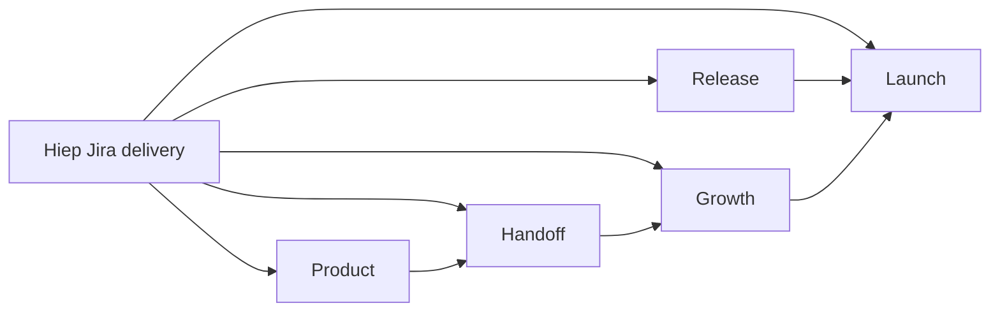

# Thiết kế bàn giao backlog Jira của Hoàng Hiệp

**Ngày:** 2026-07-15  
**Nguồn:** Atlassian MCP, project Wonderlens (`KAN`)  
**Assignee:** Hoàng Hiệp (`615a80e79cdb930072668cfe`)

## Bối cảnh

Jira hiện giao 13 task cho Hoàng Hiệp. Phần lớn là product, release, growth và
handoff docs. Repo đã có app Flutter, Vercel proxy, privacy/support pages, store
assets, promo video và báo cáo điền console. Tuy nhiên repo chưa có dịch vụ lưu
email waitlist, CRM owner, consent approval hay quyết định kiến trúc cho PII.

Mục tiêu của đợt này là tạo một bộ tài liệu dùng được ngay, dựa trên trạng thái
thật của code và asset; không biến các mục cần PM/legal/console/external service
thành trạng thái “đã xong”.

## Các phương án

### 1. Evidence-first docs batch — chọn

Hoàn tất mọi deliverable có thể kiểm chứng trong repo, tái sử dụng asset hiện
có, tạo draft/copy/checklist đầy đủ. Với phần external, ghi dependency, owner và
release gate cụ thể.

Ưu điểm: phủ rộng backlog, ít rủi ro, review được bằng Git, không tạo PII ngoài
kiểm soát. Nhược điểm: landing waitlist chưa thể “live” và legal/PM sign-off vẫn
cần con người có thẩm quyền.

### 2. Dựng luôn waitlist + tracking

Thêm landing, endpoint, nơi lưu email và analytics ngay trong đợt này.

Không chọn vì chưa có storage/CRM owner, retention/deletion policy, consent
approval hoặc ADR. Đây là thay đổi kiến trúc và privacy, không chỉ là viết trang.

### 3. Mỗi Jira task một branch riêng

Tách 13 nhánh và 13 vòng review.

Không chọn cho đợt handoff docs có liên kết chặt vì tạo nhiều bản copy dễ lệch
nhau. Một branch batch với bảng traceability giúp PM review nhất quán hơn.

## Phạm vi deliverable

| Jira | Deliverable trong repo | Mức hoàn tất dự kiến |
|---|---|---|
| KAN-4, KAN-5 | `docs/product/sprint-scope.md` | Hoàn tất bản PM review |
| KAN-6 | `docs/product/beta-success-metrics.md` | Hoàn tất metric + checklist |
| KAN-31 | `docs/release/privacy-age-rating.md` | Recommendation + legal gate |
| KAN-32 | `docs/release/store-metadata.md`, AI label, store screenshots | Copy + asset manifest + QA + repo assets |
| KAN-34 | `docs/handoff/product-flows.md` | JTBD/user/release Mermaid |
| KAN-35 | `docs/handoff/product-technical-overview.md` | Product + architecture handoff |
| KAN-36 | `docs/growth/viral-loop-strategy.md` | 3 loop + funnel/metrics |
| KAN-37 | `docs/growth/social-calendar-30-days.md` | 30 ngày + 10 draft + 3 script |
| KAN-38 | `docs/growth/build-in-public.md` | Narrative + template + 5 draft |
| KAN-39 | `docs/growth/android-beta-waitlist.md` | Spec/copy/schema; live bị gate |
| KAN-40 | `docs/launch/press-kit.md` | VI/EN copy + asset index + FAQ |
| KAN-41 | `docs/launch/product-hunt.md` | Draft + launch checklist/metrics |
| Tất cả | `docs/hiep-jira-delivery.md` | Traceability + trạng thái/gate |

## Nguyên tắc nội dung

- Nguồn sự thật theo thứ tự: code và asset hiện tại, specs/contracts/ADRs, Jira.
- Copy tiếng Việt, hướng phụ huynh đồng hành cùng trẻ 6–10 tuổi.
- Không nói “không thu thập dữ liệu” nếu ảnh được truyền tới OpenAI và có thể
  nằm trong abuse-monitoring logs tối đa 30 ngày.
- Phân biệt App Store age rating với Kids Category; không đồng nhất “4+” với
  “Made for Kids”.
- Không khai Google Play target 18+ nếu metadata và sản phẩm rõ ràng hướng trẻ
  6–10; console declaration phải phản ánh audience thật.
- Không dùng ảnh trẻ thật nếu không có consent; dùng app screenshot, object
  cutout, logo và promo asset có sẵn.
- Mọi số liệu chưa đo được ghi là target hoặc baseline cần thu thập, không ghi
  như kết quả thực tế.

## Kiến trúc tài liệu

`docs/hiep-jira-delivery.md` là trang vào. Các file chuyên đề chỉ sở hữu một loại
quyết định để tránh trùng. Handoff link ngược tới specs/ADR, release docs link
tới nguồn chính thức và asset path, growth docs link tới waitlist/press kit.

## Ranh giới triển khai

### Làm trong branch này

- Tất cả Markdown kể trên.
- Hai bổ sung KAN-32 không đổi kiến trúc: gắn nhãn `AI hỗ trợ` cho result
  `source == live`, và mở rộng tool hiện có để sinh/mirror result + timeline
  screenshot từ widget production.
- Kiểm tra link nội bộ, asset path, Mermaid fence và giới hạn copy.
- Chạy test/analyze/build để tài liệu handoff phản ánh đúng HEAD.

### Không tự làm trong branch này

- Không submit/publish App Store, Google Play, Product Hunt hoặc social post.
- Không chuyển trạng thái Jira hay đăng comment đại diện người dùng.
- Không tạo CRM, spreadsheet, form collection hoặc analytics account.
- Không tự kết luận legal sign-off.

## Xác minh

1. Script local kiểm tra mọi relative Markdown link và asset path.
2. Kiểm tra đủ 30 ngày, ít nhất 10 post draft và 3 video script.
3. Kiểm tra source URL dùng HTTPS và thuộc nguồn chính thức.
4. `flutter test`, `flutter analyze`, Android release build và iOS no-codesign
   build theo Definition of Done của repo.
5. `git diff --check`; xác nhận `docs/workflow.md` không nằm trong commit.

## Quyết định

Người dùng đã cho phép tự động duyệt phương án recommend. Chọn phương án 1 và
tiếp tục mà không dừng ở cổng phê duyệt thiết kế. Các external/legal gates vẫn
được giữ vì không thể suy ra thẩm quyền từ quyền tự chọn phương án kỹ thuật.

## Scope extension sau repo audit

Audit KAN-32 xác nhận repo đã có generator screenshot nhưng thiếu hai màn kể
core flow, đồng thời result AI-live chưa có disclosure trực quan. Hai gap này có
thể sửa và test hoàn toàn trong kiến trúc hiện tại, nên được thêm vào branch sau
design ban đầu. Extension không thêm dependency, schema, API, PII collection hay
external state; curated content không hiện nhãn AI.
